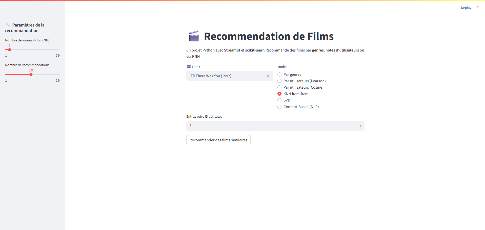

# MovieRecommenderSystem


[](https://codecov.io/gh/brimetz/MovieRecommenderSystem)


A **Streamlit** web application built in **Python** for movie recommendation.  
This project explores both **content-based filtering** (genre similarity) and **collaborative filtering** (user ratings) techniques, leveraging popular algorithms such as Pearson correlation and Cosine similarity.  

Designed to be a hands-on learning experience, it demonstrates key concepts in recommendation systems and provides an intuitive interface for users to discover movies tailored to their preferences.

## 📸 Preview


## 🔍 Functionalities
- Recommendation based on movie **genre** (content-based)
- Recommendation based on **users notes** (collaborative) with:
    - **Pearson** correlation
    - **Cosine** similarity
- Interactive interface with **Streamlit**
- Deployable directly via **Streamlit Cloud**.

## 📁 Datas
Use the MovieLens 100k dataset ('u.data' and 'u.item')
https://grouplens.org/datasets/movielens/100k/

## 🛠 Installation
```bash
git clone https://github.com/brimetz/MovieRecommenderSystem.git
cd MovieRecommenderSystem
pip install -r requirements.txt
```
Run the app locally:
```bash
streamlit run app.py
```

Or access the live app here:
👉 ```https://brz-movie-recommender.streamlit.app/```

## Running Tests
Run the automated tests using:
python -m pytest tests/

### Author
Baptiste Rimetz